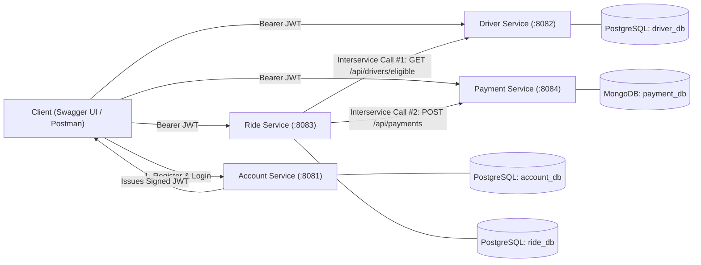

# RideLink — Distributed Ride-Hailing Microservices Backend

**Course Module:** IT3130 — Application Development Group Assignment  
**Tech Stack:** Java 17, Spring Boot 3.2.5, Spring Security (Stateless JWT), Spring WebFlux (`WebClient`), PostgreSQL, MongoDB, OpenAPI 3 / Swagger UI

---

## 1. Team & Microservice Ownership

| Microservice | Directory | Port | Database | Owner | SLIIT ID / Email |
| :--- | :--- | :---: | :--- | :--- | :--- |
| **Account Service** | `services/account-service` | `8081` | PostgreSQL (`account_db`) | M.P.P.B. Marasinghe | `it24102036@my.sliit.lk` |
| **Driver & Vehicle Service** | `services/driver-service` | `8082` | PostgreSQL (`driver_db`) | W.U.V.P. Bandara | `it24101830@my.sliit.lk` |
| **Ride Management Service** | `services/ride-service` | `8083` | PostgreSQL (`ride_db`) | Nethmika B.A.P.U.D | `it24102843@my.sliit.lk` |
| **Fare & Payment Service** | `services/payment-service` | `8084` | MongoDB (`payment_db`) | Kavinda B.M.D. | `it24101570@my.sliit.lk` |

---

## 2. System Architecture & Interservice Communication

Each microservice is independently deployable and owns its own isolated database (`account_db`, `driver_db`, `ride_db` on PostgreSQL, and `payment_db` on MongoDB). Cross-database joins are strictly prohibited; all cross-domain operations occur synchronously over HTTP REST using Spring `WebClient` with JWT Bearer token propagation.



### Ride Lifecycle State Machine (`ride-service`)
- `REQUESTED` $\rightarrow$ `ASSIGNED` (calls `driver-service` `GET /api/drivers/eligible?area=...`) or `CANCELLED`
- `ASSIGNED` $\rightarrow$ `ACCEPTED` (by assigned driver) or `CANCELLED`
- `ACCEPTED` $\rightarrow$ `IN_PROGRESS` (by assigned driver) or `CANCELLED`
- `IN_PROGRESS` $\rightarrow$ `COMPLETED` (calls `payment-service` `POST /api/payments` and records `finalFare`)
- Invalid transitions return **`409 Conflict`**.
- Unreachable downstream services (`driver-service` or `payment-service`) return **`503 Service Unavailable`**.

---

## 3. Prerequisites & Database Setup

### Prerequisites
- **JDK 17**
- **Maven 3.9+** (or use the included `./mvnw` wrapper)
- **PostgreSQL 15+** running on `localhost:5432`
- **MongoDB** (local `localhost:27017` or MongoDB Atlas via `MONGODB_URI`)
- **Postman** for running the automated API collection (`postman/`)

### PostgreSQL Setup (Run once as `postgres` superuser)
```sql
CREATE USER ridelink_user WITH ENCRYPTED PASSWORD 'ridelink_pass';

CREATE DATABASE account_db OWNER ridelink_user;
CREATE DATABASE driver_db OWNER ridelink_user;
CREATE DATABASE ride_db OWNER ridelink_user;

GRANT ALL PRIVILEGES ON DATABASE account_db TO ridelink_user;
GRANT ALL PRIVILEGES ON DATABASE driver_db TO ridelink_user;
GRANT ALL PRIVILEGES ON DATABASE ride_db TO ridelink_user;
```

---

## 4. Startup Order & Swagger UI Links

Start the four services in separate terminal windows **in this exact order** (since `ride-service` makes downstream calls to `driver-service` and `payment-service`):

### 1. Start Account Service (`:8081`)
```bash
cd services/account-service
mvn spring-boot:run
```

### 2. Start Driver & Vehicle Service (`:8082`)
```bash
cd services/driver-service
mvn spring-boot:run
```

### 3. Start Fare & Payment Service (`:8084`)
```bash
cd services/payment-service
mvn spring-boot:run
```

### 4. Start Ride Management Service (`:8083`)
```bash
cd services/ride-service
mvn spring-boot:run
```

### Swagger UI Endpoints
| Service | Swagger URL |
| :--- | :--- |
| **Account Service** | [http://localhost:8081/swagger-ui.html](http://localhost:8081/swagger-ui.html) |
| **Driver Service** | [http://localhost:8082/swagger-ui.html](http://localhost:8082/swagger-ui.html) |
| **Ride Service** | [http://localhost:8083/swagger-ui.html](http://localhost:8083/swagger-ui.html) |
| **Payment Service** | [http://localhost:8084/swagger-ui.html](http://localhost:8084/swagger-ui.html) |

---

## 5. Running Unit Tests

Each service contains isolated JUnit 5 + Mockito unit tests:

```bash
cd services/account-service && mvn test   # 4 tests (AuthServiceTest)
cd services/driver-service  && mvn test   # 4 tests (DriverServiceTest)
cd services/payment-service && mvn test   # 4 tests (PaymentServiceTest)
cd services/ride-service    && mvn test   # 5 tests (RideServiceTest)
```

---

## 6. Postman Collection & Automated End-to-End Run

The repository includes a ready-to-run Postman Collection and Environment under [`postman/`](postman/):
- `postman/RideLink.postman_collection.json`
- `postman/RideLink_Local.postman_environment.json`

### How to Run:
1. Open **Postman** $\rightarrow$ click **Import** $\rightarrow$ select both files from the `postman/` folder.
2. Select **`RideLink Local`** in the top-right Environment dropdown.
3. Click **Run collection** on the `RideLink` collection to execute all 4 service folders, the **Integration — Full Ride Lifecycle** flow, and **Negative Scenarios** (`409 Conflict`, `404 Not Found`, `403 Forbidden`).
