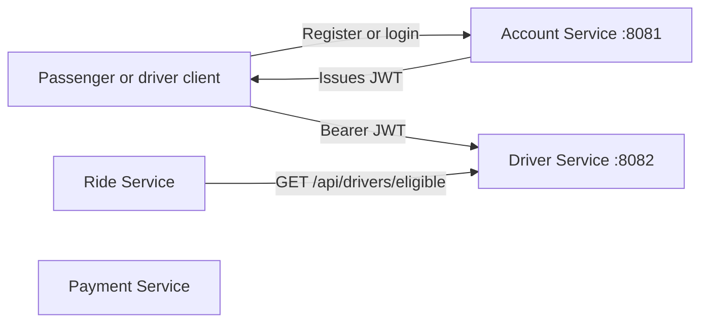

# RideLink Driver Service

Driver Service manages driver profiles, vehicles, availability, service areas, and the eligible-driver lookup used by Ride Service. It verifies JWTs issued by Account Service; it does not issue tokens.

## Team and Service Ownership

| Service | Owner / status |
| --- | --- |
| Account Service | Owner not identified in checked-in docs; account branch's latest contributor is M.P.P.B. Marasinghe. |
| Driver Service | W.U.V.P. Bandara (Vidura), per the driver task brief. |
| Payment Service | Owner and implementation details are not available in the checked-out service documentation. |
| Ride Service | Owner and implementation details are not available in the checked-out service documentation. |

## Architecture



Account Service issues tokens. Driver Service verifies them and stores its own operational driver data in PostgreSQL. Ride Service uses the eligible-driver endpoint. Payment Service is shown as part of the system; its integration with these modules is not defined in the checked-out code.

## Prerequisites

- JDK 17.
- Maven 3.9.16 (the driver module's Maven Wrapper is pinned to 3.9.16); alternatively use an installed Maven 3.9.16.
- PostgreSQL. The project does not pin a PostgreSQL server version.
- MongoDB is listed as a full-project prerequisite, but no MongoDB configuration or server version is available in the checked-out service modules.
- Postman for API testing. The project does not pin a Postman version.

The driver module uses Spring Boot 3.2.5 and springdoc-openapi 2.5.0.

## Database and Configuration Setup

The available configurations confirm `account_db` and `driver_db` on PostgreSQL. The payment and ride database names and engines are not specified in the available module files, so provision those from their owning services' configuration rather than guessing.

Create the PostgreSQL role and the two confirmed databases (run once as a PostgreSQL administrator):

```sql
CREATE ROLE ridelink_user LOGIN PASSWORD 'replace-with-a-local-password';
CREATE DATABASE account_db OWNER ridelink_user;
CREATE DATABASE driver_db OWNER ridelink_user;
```

If the role already exists, update its password with `ALTER ROLE` instead of creating it again. Use local development credentials only.

There is currently no `application-example.yml` in this module. Its checked-in `src/main/resources/application.yml` uses `driver_db`, port `8082`, and local fallback credentials. For local development, configure these environment variables before starting the service:

```powershell
$env:DB_USERNAME = "ridelink_user"
$env:DB_PASSWORD = "replace-with-your-local-password"
$env:JWT_SECRET = "replace-with-the-same-local-secret-used-by-account-service"
```

Set `JWT_SECRET` to the same sufficiently long secret used by Account Service so tokens can be verified. Never use the temporary fallback secret in a deployed environment. If an `application-example.yml` is added later, copy it to `src/main/resources/application.yml` and fill in the datasource URL, username, password, port, and shared JWT secret.

## Startup Order

Run each service in a separate terminal, from its module directory, in this order. The account and driver paths/configurations are available; payment and ride commands require those modules to be present in the checkout.

1. Account Service:

   ```bash
   cd services/account-service
   mvn spring-boot:run
   ```

2. Driver Service:

   ```bash
   cd services/driver-service
   mvn spring-boot:run
   ```

3. Payment Service:

   ```bash
   cd services/payment-service
   mvn spring-boot:run
   ```

4. Ride Service:

   ```bash
   cd services/ride-service
   mvn spring-boot:run
   ```

## Swagger UI

| Service | Swagger UI |
| --- | --- |
| Account Service | [http://localhost:8081/swagger-ui.html](http://localhost:8081/swagger-ui.html) |
| Driver Service | [http://localhost:8082/swagger-ui.html](http://localhost:8082/swagger-ui.html) |
| Payment Service | Port and Swagger path are not available in the checked-out files. |
| Ride Service | Port and Swagger path are not available in the checked-out files. |

## Tests

Run Driver Service's unit tests from its module directory:

```bash
cd services/driver-service
mvn test
```

The current tests cover availability updates, ownership enforcement, not-found behavior, and an empty eligible-driver result. This checkout is not a configured root multi-module Maven build; run tests separately in each service module that is present.

## Test-Only Accounts

No pre-registered users or seed-data script is checked in. For local testing only, register sample accounts with Account Service at `POST http://localhost:8081/api/auth/register`, then log in at `POST http://localhost:8081/api/auth/login`. These example credentials are not pre-created and must never be used outside a local test database.

Passenger registration body:

```json
{
  "email": "passenger.test@ridelink.local",
  "password": "PassengerTest123!",
  "fullName": "Test Passenger",
  "phone": "0000000000",
  "role": "PASSENGER"
}
```

Driver registration body:

```json
{
  "email": "driver.test@ridelink.local",
  "password": "DriverTest123!",
  "fullName": "Test Driver",
  "phone": "0000000001",
  "role": "DRIVER"
}
```

Use the returned driver JWT as a Bearer token when creating a driver profile with `POST http://localhost:8082/api/drivers`. The profile request requires `licenseNumber` and `serviceArea`.

## Postman

There is no Postman collection checked into the available service files. When the team collection is available, import its JSON file in Postman using **Import**, then set the Account and Driver base URLs to `http://localhost:8081` and `http://localhost:8082`. Log in with a local test account and use the returned JWT as a Bearer token for protected Driver Service requests. Do not put real passwords or tokens in a committed collection or environment file.

## Known Limitations

- This branch documents and implements Driver Service; the payment and ride module configuration, database setup, ports, owners, and API collections are not available here.
- No sample accounts are seeded automatically; create local test users through Account Service.
- The checked-in driver configuration enables SQL logging and Hibernate `ddl-auto: update`; both should be reviewed for production use.
- The JWT fallback in the local configuration is temporary and must be replaced with a shared secret supplied outside source control.